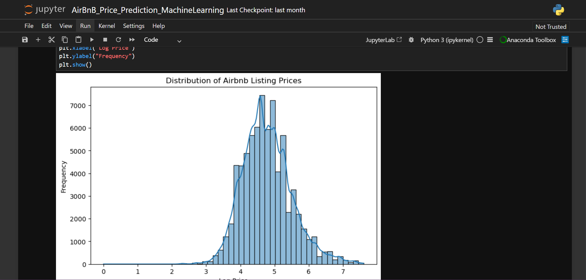
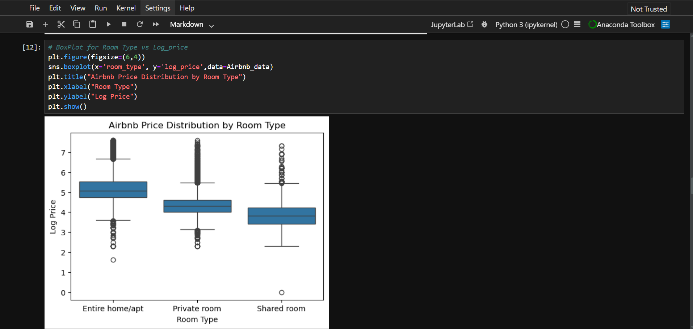
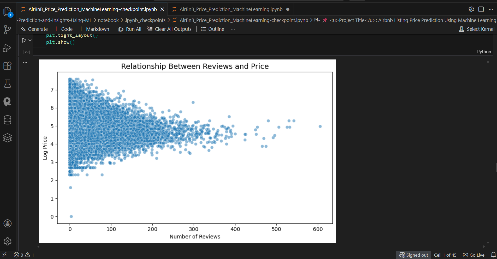

# 🤖 Airbnb Price Prediction using Machine Learning

## 📑 Table of Contents

- <a href="#project-overview">🔎 Project Overview</a>
- <a href="#dataset">📊 Dataset</a>
- <a href="#work-flow">🧠 Work Flow</a>
- <a href="#pexploratroy-data-analysis">🧹 Exploratory Data Analysis</a>
- <a href="#model-used">🤖 Model used</a>
- <a href="#project-structure">📂 Project Structure</a>
- <a href="#tech-stack">🛠 Tech Stack</a>
- <a href="#key-insights">💡 Key Insights</a>
- <a href="#project-report">📄 Project Report</a>
- <a href="#conclusion">📝 Conclusion</a>
- <a href="#author-contact">📎Author & Contact</a>


<h2><a class="anchor" id="project-overview"></a>🔎 Project Overview</h2>

This project focuses on predicting Airbnb listing prices using machine learning techniques. The analysis explores how different listing features such as room type, number of reviews, and host characteristics influence pricing.

The project includes data cleaning, exploratory data analysis (EDA), feature engineering, and machine learning model training to estimate listing prices.

---

<h2><a class="anchor" id="dataset"></a>📊 Dataset</h2>

The dataset contains information about Airbnb listings including:

* Room type
* Number of reviews
* Host response rate
* Availability
* Host experience
* Listing characteristics

These variables were used to understand the factors affecting Airbnb pricing.

---

<h2><a class='anchor' id="work-flow"></a>🧠 Work Flow</h2>

1. Data Loading
2. Data Cleaning and Preprocessing
3. Exploratory Data Analysis
4. Feature Engineering
5. Model Training
6. Model Evaluation
7. Price Prediction

---

<h2><a class='anchor' id="pexploratroy-data-analysis"></a>🧹Exploratory Data Analysis</h2>

Key visualizations used in the project include:

* Price Distribution

*** 

* Room Type vs Price

***

* Relationship Between Reviews and Price


Insights from EDA show that room type and listing popularity significantly influence pricing.

---

- <a href="#model-used">🤖 Model Used</a>

The model was trained to predict Airbnb listing prices based on multiple features extracted from the dataset.

The workflow includes:

* Feature encoding
* Train-test split
* Model training
* Prediction analysis

---

## Model Evaluation

Model performance was evaluated by comparing predicted prices with actual listing prices.

The results show a strong correlation between predicted and actual values, indicating that the model performs well in capturing pricing patterns.

---

<h2><a class="anchor" id="project-structure">📂 Project Structure</a></h2>

```
Airbnb-Price-Prediction/
│
├── dataset/
│   └── Airbnb_data.csv
│
├── notebook/
│   └── AirBnB_Price_Prediction_MachineLearning.ipynb
│
├── images/
│   ├── room_type_price.png
│   ├── reviews_vs_price.png
│   ├── actual_vs_predicted.png
│
├── report/
│   └── Airbnb_Price_Prediction_Project_Report.pdf
│
├── README.md
└── requirements.txt
```

---

<h2><a class="anchor" id="tech-stack"></a>🛠 Tech Stack</h2>

- 🐍 **Python**
- 🐼 **Pandas**
- 🔢 **NumPy**
- 📈 **Matplotlib**
- 🎨 **Seaborn**
- 🤖 **Scikit-Learn**
- 📓 **Jupyter Notebook**
- 💻 **VS Code**
- ⚡ **XGBoost**

---

<h2><a class="anchor" id="key-insights"></a>💡 Key Insights</h2>

* Entire homes have the highest median prices compared to other room types.
* Listings with lower prices tend to receive more reviews.
* Room type plays a significant role in determining Airbnb listing prices.

---

<h2><a class="anchor" id="conclusion"></a>📝 Conclusion</h2>

This project demonstrates how machine learning can be used to predict Airbnb listing prices based on listing characteristics. The analysis highlights important factors that influence pricing and shows how data-driven insights can be used to understand the Airbnb marketplace.

---

- <a href="#project-report">📄 Project Report</a>

 Full Project Report:  
 
[Airbnb Price Prediction Report](report/Airbnb_Price_Prediction_Project_Report.pdf)

<h2><a class="anchor" id="author-contact"></a>📎Author & Contact</h2>  

Aspiring Data Analyst transitioning from IT administration to data analytics.

**Abhishek Bhavikatti** 
  - Data Analyst 
  - 📧 Email: bhavikattiabhishek07@gmail.com
  - 🔗 [LinkedIn](www.linkedin.com/in/abhishek-bhavikatti-93a482231)
